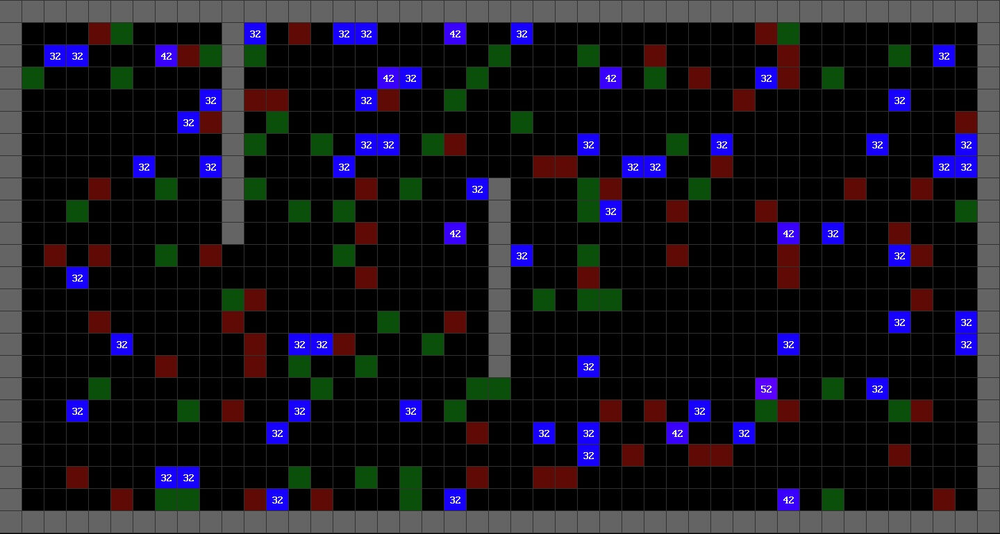

# Modeling

This is [Free Oberon](https://free.oberon.org/en/) program that simulates genetic algorithm.

## Runing

Download this repository and run `Modeling.exe` (on Windows).

## Compilation

Download this repository and move the folder `Modeling` into the `Programs` subdiretory of Free Oberon, open `Modeling.Mod` in Free Oberon and press F9.

This can be done on Win and Linux.

## Description

The programme simulates the operation of a genetic algorithm. 
The action takes place in a generated game world where there are walls (grey cells), food (green cells), poison (red cells) and bots-players (blue cells with numbers that mean the current amount of health).
Food adds 10 health to a bot.
Poison completely kills a bot with any amount of health.
Bots can move on the floor - one move per turn, they can also grab food on neighbouring squares and change poison into food with the command "grab", look at neighbouring squares, turn around. The goal of bots is to survive as long as possible.
A bot's brain or memory consists of 64 commands that denote one possible action. When generating zero generation, all the command are filled randomly. After the end of the generation life, the 8 best bots (who survived the longest) are cloned 8 times, that is, they give offspring in the form of a new generation. To speed up evolution, a mutation is added when creating a new generation - two bots out of eight survivors randomly change one code in memory.
Over time, the genetic algorithm leads to writing the most profitable programme of action for the bots.

## Log

After the programme is executed, a .txt file with logs is generated. 
It specifies the maximum length of life (in steps) in a certain generation.